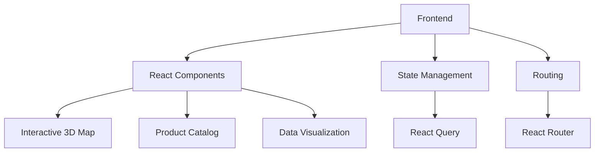

# System Patterns

## Architecture Overview

## Key Technical Decisions
- Component-based architecture for modularity
- TypeScript for type safety
- Tailwind CSS for utility-first styling
- shadcn-ui for consistent UI components
- React Query for server state management
- Framer Motion for animations (planned)

## Component Relationships
- Index page composes all main sections
- Interactive3DSyriaMap provides crisis visualization
- ProductCatalog displays medical equipment
- ImplementationSection shows deployment timeline
- ImpactSection demonstrates projected outcomes

## Critical Paths
1. Data loading and visualization
2. Interactive map functionality
3. Product filtering system
4. Responsive design implementation
