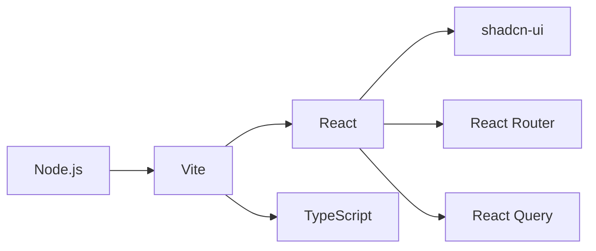

# Tech Context

## Core Technologies
- React 18 (TypeScript)
- Vite build system
- Tailwind CSS (v3.4)
- shadcn-ui component library
- React Router v6
- React Query v5

## Development Setup

## Dependencies
### Key Runtime Dependencies:
- @tanstack/react-query
- react-router-dom
- framer-motion
- lucide-react
- recharts

### Key Dev Dependencies:
- @vitejs/plugin-react-swc
- tailwindcss
- typescript
- eslint

## Tool Usage Patterns
- Vite: Development server and production builds
- ESLint: Code quality checks
- Tailwind: Utility-first CSS styling
- shadcn-ui: Pre-built accessible components
- React Query: Data fetching and caching

## Technical Constraints
- Client-side only application
- No backend API currently implemented
- Static data models for demonstration
- Responsive design requirements
